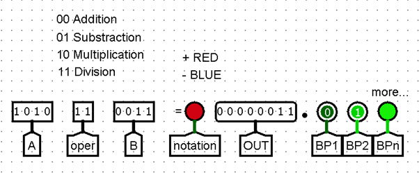
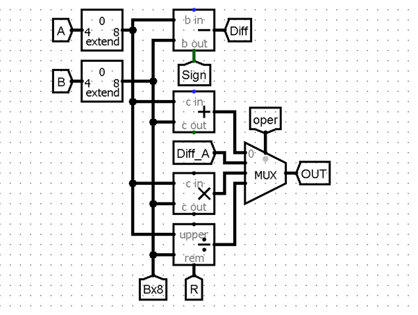
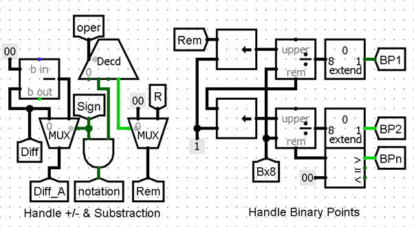

# 4-Bit Digital Calculator in Logisim

This repository contains the Logisim circuit file for a 4-bit digital calculator. The calculator is designed with a modular architecture, centered around a simple Arithmetic Logic Unit (ALU) that performs four fundamental binary arithmetic operations.

## Features

-   **Modular Design:** Separate, self-contained modules for each arithmetic operation.
-   **4-Bit Operands:** The calculator processes two 4-bit binary inputs (A and B).
-   **Core Arithmetic Operations:**
    -   Addition
    -   Subtraction (using Two's Complement)
    -   Multiplication (8-bit result)
    -   Division (4-bit quotient, 4-bit remainder)
-   **Integrated ALU:** An opcode-driven ALU selects the active operation and routes the correct result to the output.

## System Architecture

The calculator's design emulates the basic principles of a modern CPU's ALU.

-   **Modules:** Each arithmetic operation is handled by a dedicated sub-circuit. Subtraction is cleverly implemented by reusing the adder hardware, demonstrating the efficiency of two's complement arithmetic.
-   **Control Logic:** A 2-bit `oper` (opcode) input is used to select the function:
    -   `00`: Addition (A + B)
    -   `01`: Subtraction (A - B)
    -   `10`: Multiplication (A * B)
    -   `11`: Division (A / B)
-   **Data Path:** A **4-to-1 Multiplexer (MUX)** acts as the central data router. It takes the `oper` code as its select lines and passes the output from only the chosen arithmetic module to the final `OUT` bus.

### Circuit Diagram

## How to Use

1.  **Software:** You need [Logisim](https://sourceforge.net/projects/circuit/files/2.7.x/2.7.1/) to open and simulate the circuit.
2.  **Open the File:** Download the `4-bit_calculator.circ` file from this repository and open it in Logisim.
3.  **Run Simulation:**
    -   Set the two 4-bit inputs, `A` and `B`, using the input pins.
    -   Set the 2-bit `oper` input to choose the desired operation.
    -   The result will be displayed on the `OUT` bus and the `Remainder` bus (for division).
    -   Toggle the clock to step through sequential operations like multiplication and division.

## License

This project is licensed under the MIT License. See the [LICENSE](LICENSE) file for details.
